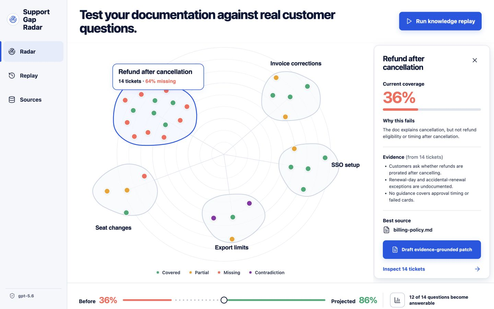
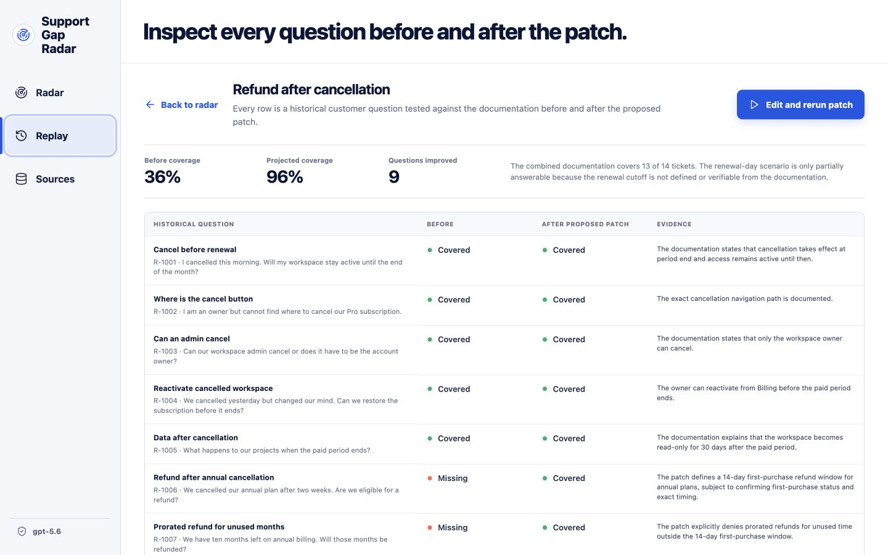
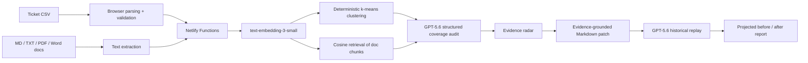

# Support Gap Radar

> Test your documentation against the questions customers actually asked.

Support Gap Radar is a documentation regression-testing workspace for support and knowledge teams. It converts historical customer tickets into a reusable test suite, finds where current help content fails, drafts evidence-grounded documentation patches, and replays the same questions to estimate the change in answerability.

**OpenAI Build Week category:** Work and Productivity  
**OpenAI models:** `gpt-5.6` and `text-embedding-3-small`  
**Status:** Hackathon MVP with an immediately explorable sample workspace and a live custom-upload workflow.



## Why this is different

Support platforms already summarize tickets and generate articles. Support Gap Radar treats past customer questions as **tests**:

1. Run the tests against current documentation.
2. Inspect missing, partial, and contradictory answers.
3. Draft a proposed documentation patch from source evidence and consistent resolved outcomes.
4. Replay the same tests against the proposed patch.
5. Review the projected coverage change question by question.

The product is vendor-neutral and accepts exported CSV tickets plus Markdown, text, PDF, `.doc`, or `.docx` documentation. It reports **projected documentation coverage**, never guaranteed ticket deflection.

## Product tour

- **Evidence radar:** Ticket clusters appear as an explorable semantic map with four explicit states: covered, partial, missing, and contradiction.
- **Gap inspector:** Select a cluster to see why the current content fails, supporting evidence, the best source document, and whether it is safe to draft.
- **Evidence-grounded patch:** GPT-5.6 proposes editable Markdown only from the supplied sources and consistent ticket resolutions.
- **Contradiction guardrail:** Conflicting policies block publishable drafting and request a human subject-matter decision.
- **Knowledge Replay:** Every historical question is retested against current documentation plus the proposed patch, producing a row-level before/after report.
- **Markdown export:** Export the reviewed patch for any knowledge-management system.



## Architecture



Embeddings locate related tickets and documentation passages. Similarity is not treated as proof that a question is answered; GPT-5.6 performs a structured, source-bounded coverage judgment. The OpenAI key remains in server-side functions and is never bundled into the browser.

## Quick start

### Requirements

- Node.js 20.19 or newer
- An OpenAI API key with access to `gpt-5.6`

### Install and run

```bash
npm install
cp .env.example .env.local
```

Add the key to `.env.local`:

```dotenv
OPENAI_API_KEY=your_key_here
OPENAI_MODEL=gpt-5.6
OPENAI_EMBEDDING_MODEL=text-embedding-3-small
```

Then start the app:

```bash
npm run dev
```

Open the local URL printed by Netlify CLI, normally `http://localhost:8888`.

The initial SaaS workspace is precomputed, so judges can inspect the radar without an API call. Uploading custom data, drafting, and replaying use the live API.

## Test it with sample data

Three synthetic, license-friendly datasets are included:

| Scenario | Ticket file | Documentation | What it demonstrates |
| --- | --- | --- | --- |
| SaaS billing | `samples/saas-billing/tickets.csv` | Three `.md` files in the same folder | Refund gaps, strong SSO coverage, and a conflicting export limit |
| Marketplace payouts | `samples/marketplace-payouts/tickets.csv` | `payout-policy.md` | Repeated operational questions against a compact policy |
| HR leave | `samples/hr-leave/tickets.csv` | `leave-policy.md` | An internal knowledge-team use case outside customer support |

For a custom CSV, use these recommended columns:

```csv
id,subject,description,resolution,priority,created_at
T-001,Refund timing,When will my refund arrive?,Refund approved within five business days,high,2026-06-01
```

Accepted aliases include `ticket_id`, `case_id`, `title`, `body`, `message`, `question`, `outcome`, `answer`, and `final_reply`. A resolution is strongly recommended because it gives the proposed article a historical evidence trail; it never makes the current documentation count as covered.

## Validation and limits

- 4–80 tickets per analysis
- Up to 12 documentation files
- Ticket CSV up to 2 MB
- Documentation up to 3 MB per file and 120,000 extracted characters total
- Supported documentation: Markdown, text, PDF, `.doc`, and `.docx`
- Model output uses Zod-backed Structured Outputs
- API errors are converted to safe, actionable UI messages
- OpenAI Responses are created with `store: false`

Run all local checks:

```bash
npm run check
```

Run the small live OpenAI integration check (uses six synthetic tickets and incurs API usage):

```bash
npm run smoke:live
```

## How Codex accelerated the build

The majority of this project was built in one Codex task. Codex helped:

- research the competitive baseline across major support platforms and sharpen the idea from “another gap detector” into ticket-based documentation regression testing;
- generate and inspect the visual concept before implementation;
- design the React and serverless architecture;
- implement file parsing, deterministic clustering, retrieval, Structured Outputs, guardrails, and historical replay;
- create three synthetic datasets, focused tests, responsive UI, documentation, and deployment configuration;
- run lint, tests, production builds, security checks, and a live GPT-5.6 smoke test.

Key product decisions are recorded in [`docs/DECISIONS.md`](./docs/DECISIONS.md). The design system is recorded in [`docs/DESIGN_SYSTEM.md`](./docs/DESIGN_SYSTEM.md).

## Where GPT-5.6 is used

GPT-5.6 makes three bounded, structured judgments:

1. **Coverage audit:** classifies every ticket as covered, partial, missing, or contradiction using only retrieved documentation.
2. **Patch drafting:** creates an editable article from documentation and consistent resolved outcomes, or blocks drafting when policy evidence conflicts.
3. **Historical replay:** retests each ticket against current documentation plus the proposed patch and explains the projected result.

`text-embedding-3-small` powers semantic clustering and documentation retrieval. The deterministic math is implemented locally so the workflow remains inspectable.

## Repository map

```text
netlify/functions/   Serverless API entry points
server/              OpenAI workflows, schemas, clustering, retrieval, safe errors
src/                 React interface and browser-side file parsing
samples/             Three synthetic demo datasets
scripts/             Live integration smoke test
docs/                Design, decisions, demo script, and submission materials
```

## Privacy and responsible use

The app is an MVP, not a production data processor. Use synthetic or appropriately redacted support data. Uploaded text is sent to the configured OpenAI API project only when a live analysis, draft, or replay is requested. Human review is required before publishing generated documentation.

## License

MIT. See [`LICENSE`](./LICENSE).
